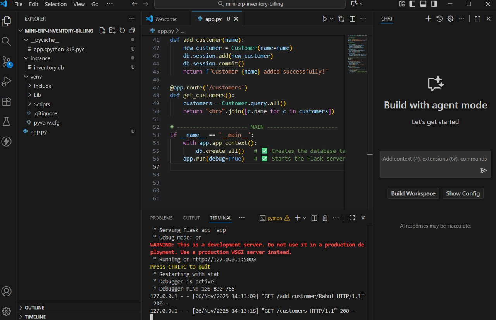
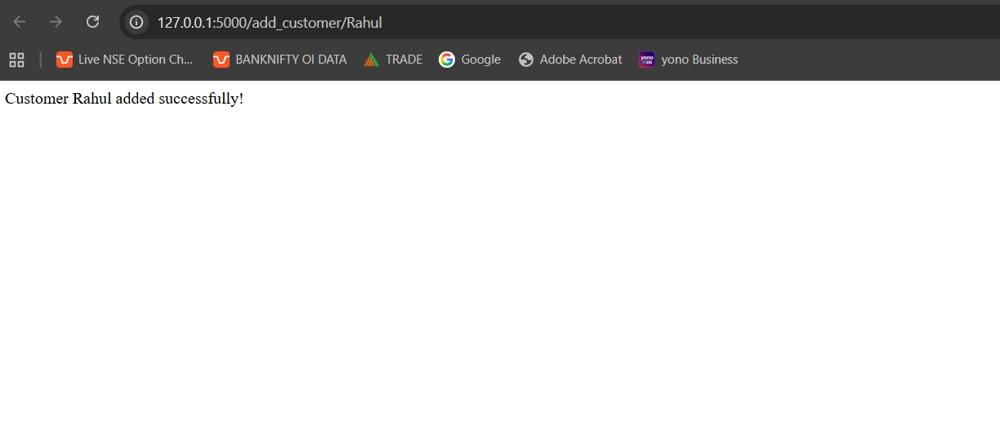
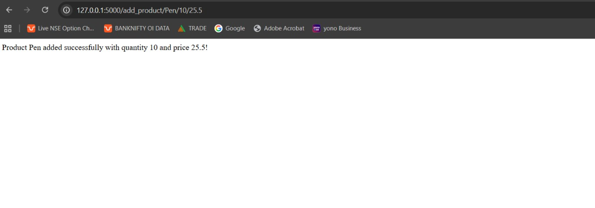
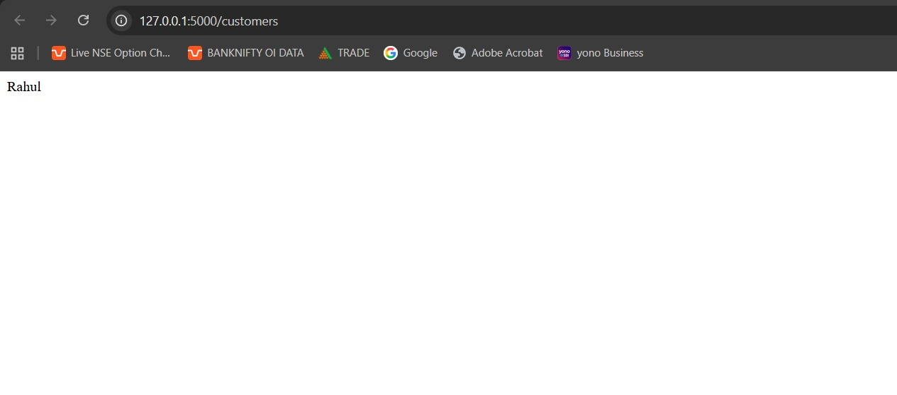
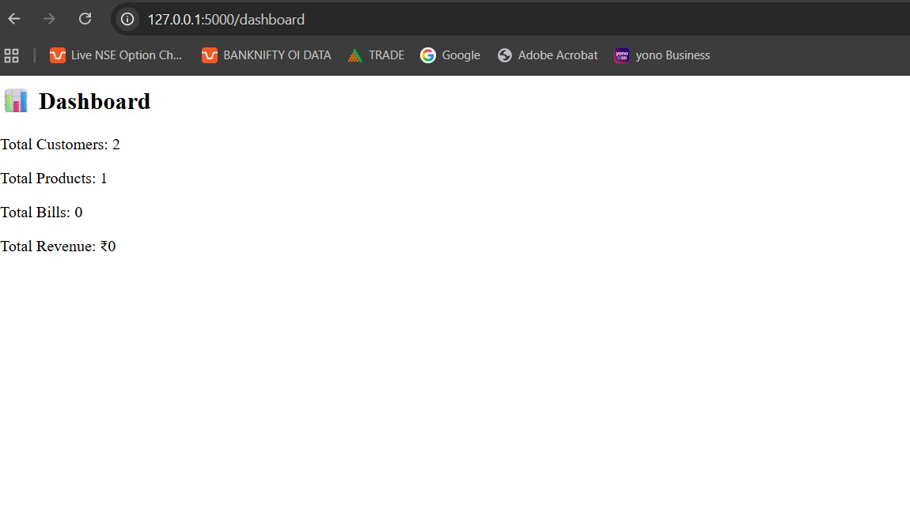
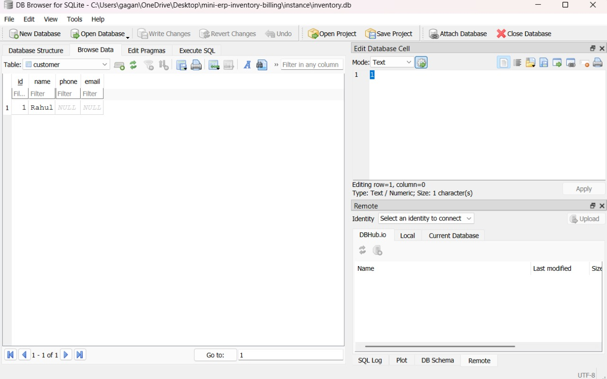

# 🧾 Mini ERP Inventory Billing System  

A lightweight **Flask + SQLite** based ERP-style system that manages **Products**, **Customers**, **Billing**, and **Dashboard summaries** — built as a simple Python project to demonstrate backend and database integration.

---

## 🚀 Features
- Add and manage customers  
- Add and manage products with price and quantity  
- View all customers and products  
- Generate bills and track stock  
- Dashboard summary (Total Customers, Products, Bills, and Revenue)  
- SQLite database for data storage  
- Flask backend for web interface  

---

## 🛠️ Tech Stack
- **Language:** Python  
- **Framework:** Flask  
- **Database:** SQLite  
- **IDE:** Visual Studio Code  

---

## ⚙️ How to Run
1. Clone this repository:
   ```bash
   git clone https://github.com/bhoyarapurva23399/mini-erp-inventory-billing.git
   ```
   
2. Navigate to the folder:
   ```bash
   cd mini-erp-inventory-billing
   ```

3. Install required dependencies:
   ```bash
   pip install flask flask_sqlalchemy
   ```

4. Run the Flask app:
   ```bash
   python app.py
   ```
   
5. Open your browser and go to:
   ```bash
   http://127.0.0.1:5000
   ```

---

## 📸 Project Screenshots  

---

### 💻 VS Code Project View  


---

### 🧍 Add Customer  


---

### 📦 Add Product  


---

### 👥 Customer List  


---

### 📊 Dashboard  


---

### 🗄️ Database (SQLite)  


---

## 🧠 What You’ll Learn  

- Basics of the Flask web framework  
- Connecting Flask with SQLite using SQLAlchemy  
- CRUD operations (Create, Read, Update, Delete)  
- Structuring a mini backend project  
- Deploying or showcasing small Python projects on GitHub  

---

## 📄 Author  

**Apurva Bhoyar**  
💼 Aspiring Data Analyst | Transitioning from Banking to Tech  
📍 [GitHub Profile](https://github.com/bhoyarapurva23399)

---

⭐ If you like this project, give it a **star** on GitHub — it really helps!


